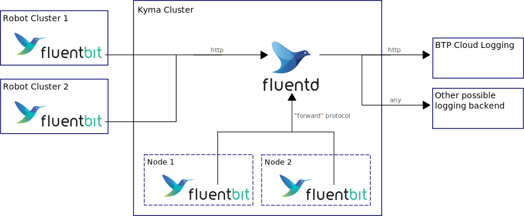

# Logging

# Architecture

The base architecture and its idea can be seen in the diagram above,
which is intentionally kept very simple.  
The main idea is that _fluent-bit_ log collectors run on each node of every cluster as _daemon set_ 
and send logs to a central _fluentd_ deployment on the _Kyma_ cluster processing, augmenting and buffering these logs. 
The fluentd instance will then send the logs to the _BTP Cloud Logging_ backend as well as optionally to other backends
(such as e.g. _loki_ running on the Kyma cluster or Google Stackdriver).  

This architecture makes it very easy to change configuration of the logging solution in a central manner in the fluentd configuration.
New backends can be added dynamically and easily in one spot and the fluent-bit instances can save resources
due to the powerful fluentd processing the logs. 

## Transport

The fluent-bit instances running on the Kyma cluster use fluent's _Forward_ protocol to communicate with fluentd.
This protocol is more efficient than HTTP, albeit not encrypted. However, within the managed BTP Kyma cluster 
this potential security issue is currently deemed negligible and tolerated in favor of better performance.  
The fluent-bit instances find the required IP through a simple k8s service

The fluent-bit instances running on the (remote) robot cluster(s) use HTTP secured by TLS to send their 
logs to fluentd. The authentication is handled by the logging proxy, running on the same pod as the fluent-bit client.
The fluent-bit client sends an HTTP request containing the logs to the proxy, where this proxy fetches an OAuth2 token
from the metadata service (containing the robot service account), attaches it to the request and forwards it as an HTTPS 
POST request to the Kyma cluster with fluentd. 
For this to work, the fluentd client has an authentication proxy running on its pod, checking the validity of the OAuth2 token.

The fluentd instance makes TLS secured HTTP requests to the BTP Cloud Logging Service (which also runs a fluentd instance internally).
For authentication the Kyma fluentd instance requires authentication details (username, password and BTP host address).
Unfortunately, there is no more secure method of communication as the BTP Service presently only offers basic auth.

# How Logs are Collected and Processed

fluent-bit creates two types of logs: 
1. kube.*: These logs are obtained by the _tail plugin_. This plugin reads k8s pod and container logs 
from files on the respective node. These are the logs that can be obtained manually by `kubectl logs <pod>`.
These logs are also enriched with extra data that fluent-bit requests from the k8s API server like pod name,
node name, release, namespace and much, much more.  
2. metric: These logs are metrics of the CPU and memory of the respective node.  

In fluentd the two types of logs bear the fluentd tags (used for internal fluentd routing) _kube_ [sic] and _metric_ respectively.

All logs (called _records_ in the fluent world) are sanitized, so they can be processed by elastic search.  
Additionally, all logs are enriched with the configurable _cluster_identifier_ field, that specifies from which cluster the record originated.

Any additional processing may be added to either the fluent-bit configs or the fluentd config (recommended).

# Deployment 

## Provisioning of SAP Cloud Logging

In case the BTP service catalog in your Kyma cluster is setup and there is a free entitlement in your BTP global/subaccount tied to the Kyma cluster
SAP Cloud Robotics can be provisioned via setup scripts.

`make kubeconfig=<path of kubeconfig file of your cluster> set-deployment-config` offers an option to enable SAP Cloud Logging.

`make kubeconfig=<path of kubeconfig file of your cluster> update-deployment` updates the deployment of cloud robotics core services accordingly.
The provisioning of SAP Cloud Robotics in the previous step might take a while. The script is waiting until the provisioning is completed.

SAP Cloud Logging relies on SAP BTP infrastructure, but it is possible to integrate other logging backends via fluentd. Our `set-deployment-config` includes an option to enable exporting logs to Google Stackdriver as an example. 

## fluent-bit edge

The fluent-bit helm chart is included in the `charts/base-robot` chart and is automatically deployed when [connecting the robot](../how-to/connecting-robot.md).  

### Configuration

Fluent-bit on the edge is configured automatically when connecting the robot.

## fluent-bit kyma

Logs from Kyma cluster are streamed via an own instance of fluent-bit according to [this howto](https://pages.github.tools.sap/perfx/cloud-logging-service/consumption/from-sap-cp-kyma/#btp-kyma-runtime-managed). 
However, differing from the howto logs are streamed to our fluentd instance first instead of streaming it to SAP Cloud Logging directly. 

### Configuration

The basic configuration of fluent-bit on Kyma is included in the helm chart `charts/base-cloud`.

Please note that the fluent-bit configuration for both kyma and edge (robot) clusters were largely taken from the [official BTP Cloud Logging guide for
logging with fluent-bit and kyma](https://pages.github.tools.sap/perfx/cloud-logging-service/consumption/from-sap-cp-kyma/).

## fluentd

The cloud-fluentd chart contains the required configuration for a default fluentd instance to run on Kyma. 
Do not forget to provide the secrets containing password, username and host as specified [here](#transport).

### Configuration

Configuration of fluentd is included into the deployment of cloud-robotics core services.
